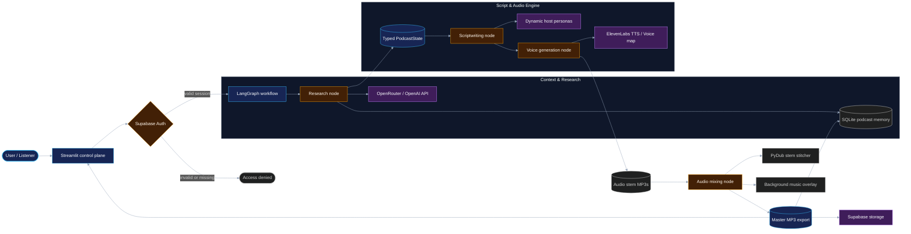

# AI Multi-Agent Podcast Generator

> A production-minded Streamlit control plane for multi-agent autonomous podcast research, scriptwriting, voice synthesis, and audio master mixing.

[](https://www.python.org/)
[](https://streamlit.io/)
[](https://www.langchain.com/)
[](https://www.docker.com/)
[](tests/)
[](https://render.com/)
[](https://ai-podcast-generator.onrender.com)

**Live dashboard:** [ai-podcast-generator.onrender.com](https://ai-podcast-generator.onrender.com)

This project turns a single topic or debate prompt into a full studio-grade multi-host podcast episode. Specialized agents fetch live context and past show memories, write dynamic multi-persona dialogue scripts, synthesize distinct voice profiles for each host via ElevenLabs, and perform master audio engineering with background music ducking using `pydub`.

The goal is to demonstrate how multi-agent state machines (`LangGraph`) can coordinate probabilistic LLM generations with deterministic audio processing, persistent episode memory, and an enterprise auth gate (`Supabase`).

> **Production note:** Built with graceful fallbacks. If ElevenLabs or OpenRouter LLM endpoints fail or rate limit, the engine automatically degrades to safe synthetic placeholders to ensure master mix compilation succeeds without crashing.

## Why This Project Matters

- **Multi-agent orchestration:** LangGraph coordinates topic research, persona/script generation, voice synthesis, and audio master mixing as a typed state transition graph (`PodcastState`).
- **Dynamic persona generation:** Dynamically invents context-aware host identities (Anchor/Analytical, Enthusiastic/Curious Analyst, Seasoned Domain Specialist) per topic instead of hardcoding static responses.
- **Persistent show memory:** SQLite tracks episode topics and dialogue history locally; Supabase manages user authentication, episode archives, and cloud audio storage.
- **Production discipline:** Dockerized runtime, Render-compatible `PORT` handling, environment-based credentials (`.env`), role-based access, and an automated test suite (`pytest`).
- **Failure-aware integrations:** API rate limits or missing keys fall back to safe silent stem generation and fallback dialogue scripts instead of failing the pipeline run.

## Architecture



### Request Lifecycle

1. **Authentication:** User authenticates via Supabase Auth in the Streamlit control plane.
2. **Context & Memory Retrieval:** The Research node queries `podcast_memory.db` for past show history and fetches live topic research.
3. **Dynamic Scriptwriting:** The Scriptwriting node creates 3 distinct host personas and generates alternating dialogue turns in JSON.
4. **Voice Synthesis:** The Voice node streams each line to ElevenLabs using mapped host voice profiles (`Bella`, `Charlie`, `George`).
5. **Stem Stitching & Music Ducking:** The Audio Mixing node stitches voice clips with micro-pauses using `pydub`, ducking background music by -15dB.
6. **Persistence:** The final master mix is stored locally in `output/final_podcast.mp3`, recorded in SQLite, and uploaded to Supabase Storage.
7. **Playback:** Streamlit streams turn-by-turn dialogue, host avatars, individual voice clips, and the master MP3.

## Safety & Reliability Boundaries

This repository is engineered for **resilient execution**:

- **Graceful TTS Fallback:** If ElevenLabs returns an error or no API key is provided, the voice generator builds silent audio stems so the master mix step can proceed without failure.
- **Graceful Script Fallback:** If LLM output fails validation, a structured multi-host fallback dialogue is supplied automatically.
- **Session Isolation:** User audio archives are isolated by `user_id` in Supabase database tables and storage buckets.
- **Dockerized Environment:** Python 3.10-slim base image with `ffmpeg` preinstalled for seamless audio conversion.

## Project Structure

```
AI_Podcast_Generator/
├── .github/
│   └── workflows/
│       └── test-pipeline.yml     # Automated CI test suite
├── assets/
│   └── bg_music.mp3             # Background music track for audio ducking
├── src/
│   ├── __init__.py
│   ├── config.py                # Database initialization & voice mappings
│   ├── researcher.py            # SQLite memory lookup & OpenRouter research tool
│   ├── scriptwriter.py          # Dynamic persona & structured dialogue writer
│   ├── voice_generator.py       # ElevenLabs TTS & fallback audio stem creator
│   └── audio_mixer.py           # Pydub master audio stitching & SQLite persistence
├── tests/
│   ├── __init__.py
│   ├── test_config.py           # Database & configuration unit tests
│   ├── test_researcher.py       # Research tool & memory tests
│   ├── test_scriptwriter.py     # Script parser & fallback tests
│   ├── test_voice_generator.py  # Voice stem synthesis tests
│   ├── test_audio_mixer.py      # Pydub audio mixing & SQLite persistence tests
│   └── test_pipeline.py         # End-to-end LangGraph state graph test
├── app.py                       # Streamlit web application & Supabase auth
├── main.py                      # LangGraph workflow definition & CLI entry point
├── Dockerfile                   # Production Docker runtime
├── requirements.txt             # Python dependencies
└── README.md                    # Project documentation
```

## Quickstart & Local Setup

### Prerequisites

- Python 3.10+
- `ffmpeg` installed locally (`brew install ffmpeg` or `sudo apt-get install ffmpeg`)

### 1. Clone the repository

```bash
git clone https://github.com/RedSamurai07/AI_Podcast_Generator.git
cd AI_Podcast_Generator
```

### 2. Set up Virtual Environment

```bash
python -m venv venv
source venv/bin/activate  # On Windows: venv\Scripts\activate
pip install -r requirements.txt
```

### 3. Configure Environment Variables

Create a `.env` file in the root directory:

```env
API_KEY=your_openrouter_or_openai_api_key
LABS_API_KEY=your_elevenlabs_api_key
SUPABASE_URL=your_supabase_project_url
SUPABASE_KEY=your_supabase_anon_key
```

### 4. Run the Application

**Option A: Streamlit Control Plane (UI)**
```bash
streamlit run app.py
```

**Option B: Terminal CLI Workflow**
```bash
python main.py
```

## Running Tests & Pipeline

Run the automated `pytest` suite locally:

```bash
pytest -v tests/
```

Run test suite with code coverage:

```bash
pytest -v --cov=src tests/
```

The repository includes a GitHub Actions workflow (`.github/workflows/test-pipeline.yml`) that automatically runs the test suite on every push or pull request to `main` / `master`.

## Docker & Cloud Deployment

### Run via Docker

```bash
docker build -t ai-podcast-generator .
docker run -p 8501:8501 --env-file .env ai-podcast-generator
```

### Render Deployment

1. Connect repository to Render.
2. Select **Web Service** with **Docker** environment.
3. Configure environment variables (`API_KEY`, `LABS_API_KEY`, `SUPABASE_URL`, `SUPABASE_KEY`).
